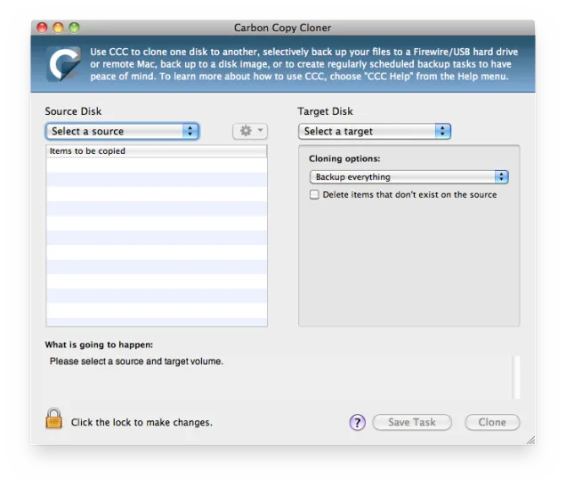

  

---

# RATIONALE #

* This repo is -mainly for internal use-, but it can be useful for those who need to migrate data in the most *resilient*, *efficient* way. 
* This repository just hold our datums gathered, checklist _et alia_ and begin and end if fulfill our needs. Anyway, *one caveat*: "There is no responsability for data loss".
* This repo is a living document that will grow and adapt over time.

### What is this repository for? ###

* Quick summary
    - Migration of custom profiles and settings between different MacOSX Operating systems, specifically from `El Capitan` to ~~Mojave~~ `High Sierra`

### How do I get set up? ###

* Summary of set up
    - _Vide_ [`colophon.md`](Colophon.md) on `source` tab (at the left of your current screen sight)
* Configuration
    - _Vide_ [`checklist.md`](Checklist.md)
* Deployment instructions
    - _Vide_ [`checklist.md`](Checklist.md)

### Changelog ###

* Please check the [Commits](https://bitbucket.org/imhicihu/migration-data-between-different-macos-environments-checklist/commits/) section for the current status

### Who do I talk to? ###

* Repo owner or admin
    - Contact `imhicihu` at `gmail` dot `com`

### Code of Conduct

* Please, check our [Code of Conduct](code_of_conduct.md)

### Legal ###

* All trademarks are the property of their respective owners.

### License ###

* The content of this project itself is licensed under the 
